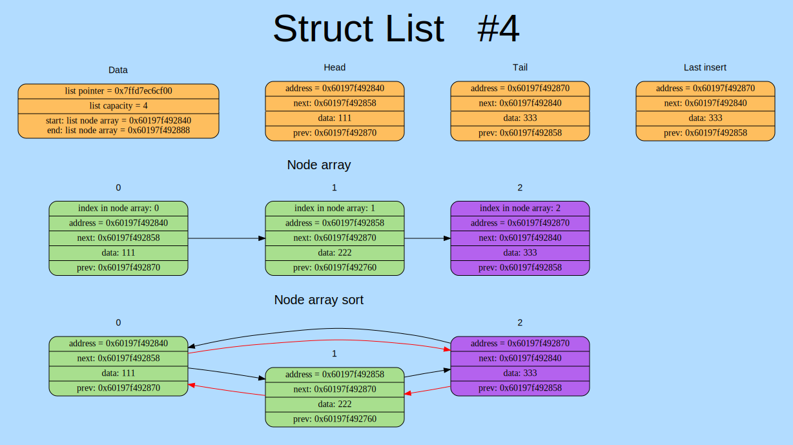
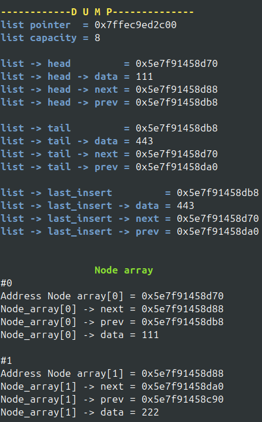

# Двусвязный список

Небольшая библиотека для создания и использования двусвязного списка
## Структура данных
В проекте используется структура ```list_node```:
```cpp
struct list_node
{
    list_node* next;
    list_node* prev;
    TYPE_DATA  data;
}
```
## Основные функции

- ```ListInsertHead ()``` - функция вставки в начало
    ```cpp
    LIST_ERROR ListInsertHead (List* list, TYPE_DATA data)
    ```
<br>

- ```ListInsertTail ()``` - функция вставки в конец
    ```cpp
    LIST_ERROR ListInsertTail (List* list, TYPE_DATA data)
    ```
<br>

- ```ListInsertAfter ()``` - функция вставки после какого-нибудь элемента
    ```cpp
    LIST_ERROR ListInsertAfter (List* list, TYPE_DATA data, list_node* node)
    ```
<br>

- ```ListInsertData ()``` - функция изменения данных
    ```cpp
    LIST_ERROR ListInsertData (List* list, list_node* node, TYPE_DATA data)
    ```
<br>

- ```ListFindData``` - функция поиска элемента по данным
    ```cpp
    LIST_ERROR ListFindData (List* list, TYPE_DATA data, list_node** dest)
    ```
<br>

- ```ListFindIndex ()``` - функция поиска индекса элемента в массиве ```node_array``` по её адресу
    ```cpp
    LIST_ERROR ListFindIndex (List* list, list_node* searched_node, size_t* dest)
    ```
<br>

- *остальные функции см. ```src/ListToolFunctions.cpp```

## Отладка
Для отладки в проекте используются 2 вида "дампа": <br>
- "Графический дамп" на основе [**Graphviz Dot**](https://graphviz.org/doc/infolang.html) cо своим не сложным языком.
    - Вызывается с помощью ```ListGraphDump ()```
    - 

- "Консольный"
    - Вызывается с помощью ```ListDump ()```
    - 

## Сборка на Linux
```bash
git clone https://github.com/dangerUser45/Double_Linked_List.git
cd Double_Linked_List/
make
```
